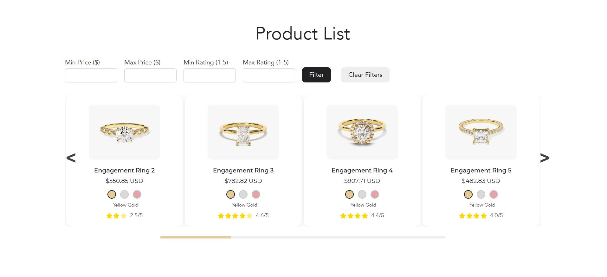

# RGoldShop

React.js ve Node.js kullanarak geliştirdiğim bir e-ticaret projesi.

Projenin canlı hâli: https://r-gold-shop.vercel.app/



## ✨ Özellikler

- 🏅 **Gerçek Zamanlı Altın Fiyatı**: [GoldAPI.io](https://www.goldapi.io/) üzerinden güncel fiyatlar
- 🎨 **Renk Seçenekleri**: Sarı, Beyaz, Pembe altın varyantları
- 📱 **Responsive Tasarım**: Tüm cihazlarda uyumlu
- 🔍 **Filtreleme**: Fiyat ve popülerlik bazlı arama
- ⭐ **Puanlama Sistemi**: 5 yıldız değerlendirme
- 🎠 **Carousel**: Ok tuşları ve kaydırma desteği

## 🛠️ Teknolojiler

**Frontend:** React.js, Styled Components, React Slick, Axios  
**Backend:** Node.js, Express.js, CORS  
**API:** [GoldAPI.io](https://www.goldapi.io/) (alternatif: Metal API, Currencylayer)

## � Kurulum

### 1. Projeyi Klonlayın
```bash
git clone <repository-url>
cd RGoldShop
```

### 2. Backend
```bash
cd backend
npm install
cp .env.example .env
# .env dosyasına GoldAPI anahtarınızı ekleyin
npm start
```

### 3. Frontend
```bash
cd frontend
npm install
npm start
```

**Gereksinimler:** Node.js v14+, [GoldAPI](https://www.goldapi.io/) anahtarı

## 🔄 API

### Endpoint'ler
- `GET /api/products` - Tüm ürünler
- `GET /api/products?minPrice=100&maxPrice=1000` - Fiyat filtresi
- `GET /api/products?minPopularity=2&maxPopularity=4` - Popülerlik filtresi

## 🚀 Vercel Deployment

### 1. Repository Hazırlığı
```bash
git add .
git commit -m "Deploy hazırlığı"
git push origin main
```

### 2. Vercel'e Deploy
1. [Vercel](https://vercel.com)'e giriş yapın
2. "Import Project" → GitHub repository seçin
3. **Framework:** "Other" seçin (Next.js değil)
4. **Root Directory:** Boş bırakın (vercel.json kullanacak)

### 3. Environment Variables (Vercel Dashboard'da)
```
GOLDAPI_KEY=your_api_key_here
FRONTEND_URL=https://your-project-name.vercel.app
NODE_ENV=production
```

### 4. Deploy Sonrası
- Frontend: `https://your-project-name.vercel.app`
- Backend API: `https://your-project-name.vercel.app/api/products`
- Otomatik HTTPS ve CDN desteği

## 📄 Lisans

MIT License